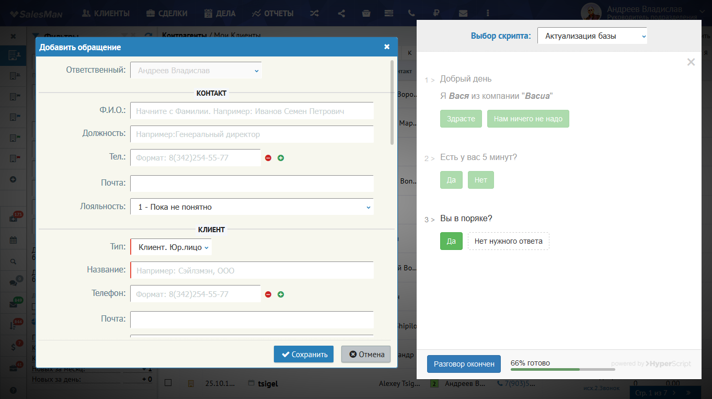

## О плагине
==================

Плагин интегрирован с сервисом HyperScript и служит для отображения скриптов продаж при добавлении Обращения

## Настройка плагина

Настройка плагина включает в себя:

### Авторизацию в сервисе HyperScript

* "Получить ключ" - Проходим авторизацию в сервисе HyperScript и получаем ключ доступа к нему
* "Получить список" - После авторизации получаем список доступных скриптов. Если скрипты доступны, то вы увидите список этих скриптов
* Выбираем из списка скриптов те, которые будут доступны для выбора пользователем

### Выбор сотрудников

* Выбираем сотрудников у которых будет появляться блок скрипта

> ### Важно
> Если не выбран ни один из сотрудников, то плагин срабатывать не будет

### Настройка доступа к управлению плагином

* Выбираем сотрудников из списка

### Выбор форм

* Выбираем формы, при вызове которых будет срабатывать плагин

> ### Важно
> Если список скриптов пуст, то плагин срабатывать не будет

## Установка плагина

Для установки плагина переходим в раздел "Плагины" панели управления. Жмем кнопку "+ Добавить" и выбираем **"Скрипты продаж"**

После подключения и обновления окна браузера в верхнем меню "Сервисы"/"Дополнения" появится кнопка перехода к управлению плагином

## Подключение плагина

Подключение плагина выполняется в разделе Панели управления / Интеграция / Плагины:

1. Нажимаем кнопку "Добавить"
2. В форме выбираем наш плагин "Скрипты продаж"
3. Сохраняем и обновляем окно браузера
4. Переходим в интерфейс плагина через меню Сервисы (вертикальное троеточие) / Дополнения / Скрипты продаж
5. Добавляем UserID и нажимаем кнопку "Получить ключ". В открывшейся форме авторизуемся
6. После авторизации получим "APIkey", который будет добавлен в соответствующее поле
7. Нажимаем кнопку "Получить список" - будут загружены скрипты и аккаунта
8. Выбираем нужные и сохраняем

## Как работает плагин

После вызова формы "Добавить обращение" плагин сместит форму влево и отобразит дополнительное окно для выбора скрипта продаж. Далее сотрудник ведет разговор с клиентом по этому скрипту

